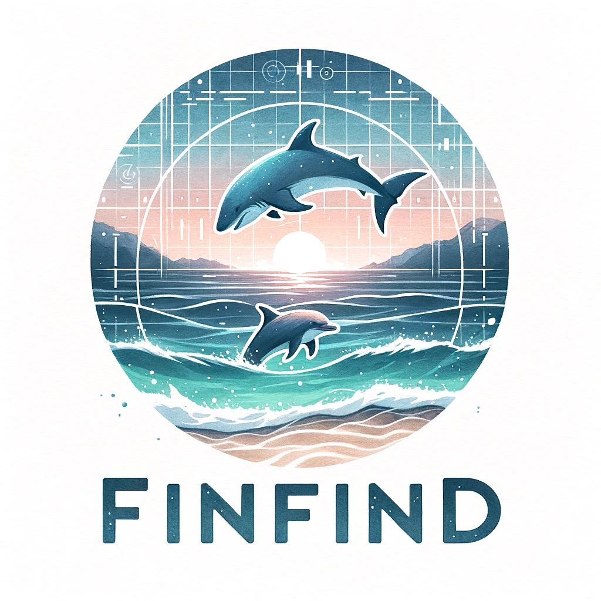
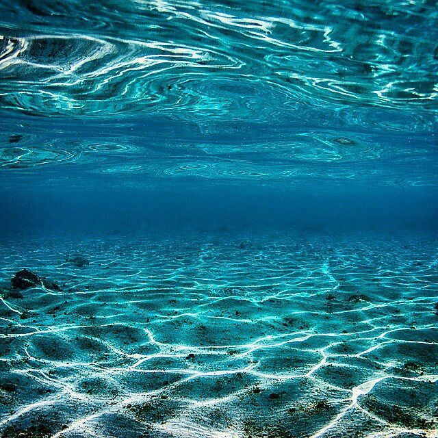
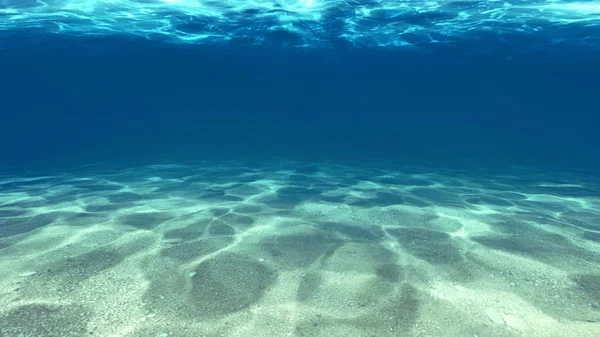
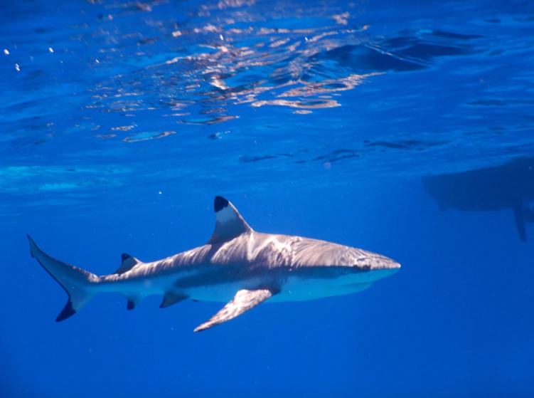
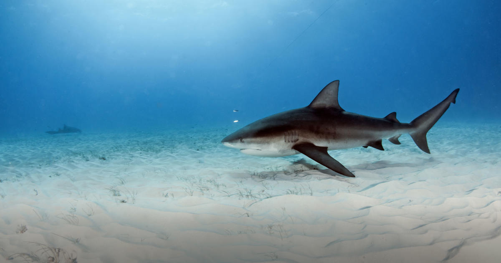

## FinFind SafeGuard

## Overview
FinFind Safeguard is an innovative technology aimed at enhancing beach safety, boosting tourism confidence, and ensuring continuous improvement in public safety and tourist experience.

## Key Features and Benefits

### Beach Safety Enhancements
- **Collaboration with Authorities**: Partnering with local authorities and lifeguards to integrate technology into existing safety protocols.
- **Real-Time Alert Systems**: Implementing alert systems to notify of shark presence, enhancing the safety of beachgoers.

### Boosting Tourism Confidence
- **Partnerships with Tourism Boards**: Collaborating with tourism boards and travel agencies to promote FinFind Safeguard-equipped beaches.
- **Technology Integration in Resorts**: Working with resorts to incorporate this technology, offering guests an additional layer of safety.

### Continuous Improvement
- **AI Algorithm Updates**: Regularly refining AI algorithms for accurate species identification.
- **User Feedback Integration**: Actively seeking feedback from end-users like lifeguards and tourists for ongoing improvements.

### Enhanced Public Safety
- **Reduced Shark Encounter Risks**: Minimizing risks associated with shark encounters, leading to safer beach activities.

### Elevated Tourist Experience
- **Peace of Mind for Tourists**: Allowing tourists to enjoy beach activities with an enhanced sense of safety.

### Strengthened Destination Reputation
- **Safe and Tourist-Friendly Locations**: Establishing a reputation as a safe, welcoming destination for tourists.

## Conclusion
FinFind Safeguard technology represents a significant advancement in beach safety and tourist experience, offering a comprehensive solution for public beaches and tourist destinations.

---

For more information, please contact [Your Contact Information].

Utilize cutting-edge artificial intelligence to accurately identify sharks in aquatic environments, supporting safety measures at beaches and tourist destinations.

 

# Data Deck:
   
[ All Data Slides](https://docs.google.com/presentation/d/1GCEIlXu9bqusEShnHxgG5mU2u6IF6JgzBkYBzqsDLYo/edit?usp=sharing)

# AlexNet: 
[AlexNet](https://colab.research.google.com/drive/1v3CwUUp9sjcOkj0G-Ulp8g6gt3dwEkZG?usp=sharing)
